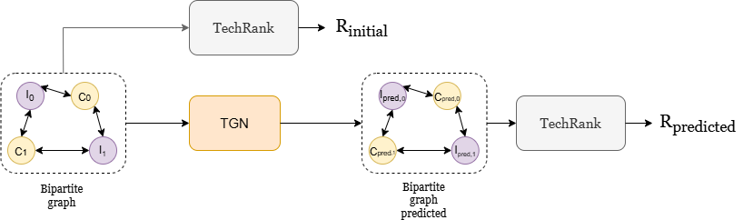

s# Forecasting Emerging Disruptive Technologies

**EPFL Semester Project - CYD Campus**
*Combining Temporal Graph Networks with TechRank for Early Detection of Disruptive Technologies*

**Author:** Tomas Garate Anderegg
**Supervisors:** Prof. Andrea Cavallaro, Julian Jang-Jaccard

---

## Abstract

This project develops a framework for forecasting emerging disruptive technologies in the context of national cyber defence. By combining **TechRank** (a PageRank-inspired centrality algorithm for bipartite networks) with **Temporal Graph Networks** (TGN), the framework identifies companies positioned for significant influence growth in the technology ecosystem.

The key idea is detecting **disruptive signals** by analyzing how company rankings evolve when TGN predicts future investment patterns. Companies that experience dramatic TechRank increases after prediction may signal early-stage disruptive trajectories.

---

## Motivation

Technological innovation evolves at an unprecedented pace, with profound implications for national security and cyber defence. **Disruptive technologies** often start weak, attract only niche users, but eventually transform entire industries (e.g., Internet, smartphones, quantum computing).

Traditional monitoring frameworks struggle to:
1. Model the temporal evolution of technology ecosystems
2. Detect early signals before disruption becomes obvious
3. Handle dynamic, non-linear changes in investment patterns

This project addresses these gaps by combining two complementary approaches: a static ranking algorithm (TechRank) and a temporal deep learning model (TGN).

---

## Research Question

> **How can Temporal Graph Networks enhance TechRank to improve temporal forecasting of cyber-relevant disruptive technologies?**

**Hypothesis:** Modeling the technology ecosystem as a dynamic bipartite graph (investors <-> companies) enables earlier identification of high-potential technologies compared to static network analysis alone.

---

## Approach

<p align="center">
  
</p>

This project combines two algorithms:

- **TechRank** — a bipartite PageRank variant that ranks companies and investors by mutual influence in a static network. See: [Mezzetti et al., 2022](https://arxiv.org/abs/2210.07824)
- **Temporal Graph Networks (TGN)** — a deep learning model that processes timestamped interaction events to predict future links in dynamic graphs. See: [Rossi et al., 2020](https://arxiv.org/abs/2006.10637)

### Gaps and Complementarity

The two algorithms address fundamentally different aspects of the problem, and their gaps are complementary:

| Aspect | TechRank | TGN |
|--------|----------|-----|
| **Input** | Static bipartite graph | Temporal sequence of events |
| **Output** | Node centrality scores | Pairwise link probabilities |
| **Temporal awareness** | None | Core capability |
| **Global ranking** | Core capability | None |
| **Prediction** | Cannot predict future | Predicts future links |
| **Bias** | Sensitive to parameter choice (alpha, beta) | Degree bias toward hubs |

**How they complement each other:**

1. **TGN fills TechRank's temporal gap**: TechRank alone can only rank companies based on the current network. By feeding TGN's predicted future graph into TechRank, we obtain forward-looking rankings that anticipate network evolution.

2. **TechRank fills TGN's ranking gap**: TGN alone produces link probabilities without any notion of which companies matter most. TechRank aggregates these predictions into meaningful centrality scores, converting local pairwise predictions into global influence rankings.

3. **Disruption detection emerges from the combination**: Neither algorithm alone can detect disruption. The **delta metric** (change in TechRank before vs. after TGN prediction) identifies companies whose structural importance is predicted to shift dramatically. This is only possible when both temporal prediction and centrality analysis are combined.

4. **Error aggregation is beneficial**: TGN may produce noisy pairwise predictions (low Precision@K at the link level), but TechRank's aggregation mechanism averages out individual errors. A company predicted to attract several high-influence investors will rank high even if some individual link predictions are wrong.

---

## Project Structure

| Script | Description |
|--------|-------------|
| `data/bipartite_investor_comp.py` | Extract Crunchbase data, build bipartite graph + prepare TGN input files (.csv, .npy) |
| `code/TechRank.py` | TechRank algorithm implementation |
| `train_self_supervised.py` | Train TGN model |
| `TGN_eval.py` | Evaluate TGN + generate predicted graph (.pkl) |
| `TechRank_Comparison.py` | Delta analysis: TechRank before vs after TGN |

---

## Dataset

**Source:** [Crunchbase](https://www.crunchbase.com/)
**Focus:** Quantum computing & quantum key distribution companies

| Metric | Value |
|--------|-------|
| Companies | 223 |
| Investors | 1,016 |
| Funding events | 1,330 |
| Edge features | 2 (raised amount USD, #investors) |
| Timespan | ~117 years of data |
| Train/Val/Test split | 70% / 15% / 15% (chronological) |

**Graph Properties:**
- Bipartite structure: Investor (type-1) <-> Company (type-0)
- Sparse (density = 0.0059)
- Hub structure: few highly connected investors, many low-degree companies
- Extreme class imbalance: 0.59% positive links (169:1 negative-to-positive ratio)

---

## Installation

```bash
# Python >= 3.7 required
pip install torch==1.6.0
pip install pandas==1.1.0
pip install scikit-learn==0.23.1
pip install networkx
pip install scipy
pip install matplotlib
```

---

## Usage

### 1. Data Preparation

```bash
python -m data.bipartite_investor_comp
```

### 2. Train TGN

```bash
python train_self_supervised.py \
    --use_memory \
    --prefix tgn-attn \
    --n_epoch 100 \
    --patience 10 \
    --lr 1e-4 \
    --node_dim 200 --time_dim 200 --memory_dim 200 --message_dim 200 \
    --use_wandb --wandb_project "tgn-experiments" \
    --n_runs 6
```

### 3. Evaluate TGN + Generate Predictions

```bash
python TGN_eval.py \
    --data crunchbase \
    --model_path saved_models/tgn-dcl-crunchbase.pth \
    --use_memory \
    --auto_detect_params \
    --run_techrank \
    --temporal_validation --temporal_split 0.6 \
    --prediction_threshold 0.45
```

### 4. Delta Analysis

```bash
python TechRank_Comparison.py \
    --data crunchbase \
    --mapping_dir data/mappings \
    --alpha 0.3 --beta -5 \
    --save_dir techrank_comparison \
    --plot --threshold 0.001
```

---

## Evaluation Metrics

### Link Prediction (TGN Performance)

- **AUROC / AP**: Binary classification metrics for link prediction
- **MRR (Mean Reciprocal Rank)**: Rank of first correct prediction
- **Recall@K**: Proportion of true links found in top-K predictions

### Ranking Validation (Pipeline Performance)

- **Spearman Rank Correlation**: Agreement between predicted and actual company rankings
- **Top-K Overlap**: Set intersection between predicted and true top-K companies
- **delta_R (Delta Ranking)**: Relative change in TechRank score
  ```
  delta_R = (TechRank_predicted - TechRank_initial) / (TechRank_initial + epsilon)
  ```

---

## Improvements

### Monte Carlo TechRank (Uncertainty Propagation)

**The problem:** TGN outputs a probability for each company-investor pair. For example:

| Pair | TGN Probability |
|------|----------------|
| Company A - Investor X | 0.99 |
| Company A - Investor Y | 0.46 |
| Company B - Investor Z | 0.44 |
| Company B - Investor W | 0.80 |

Currently, the pipeline applies a hard threshold (e.g., 0.45): edges above become part of the graph, edges below are discarded. With threshold=0.45:
- Company A gets **2 edges** (0.99 and 0.46 both pass)
- Company B gets **1 edge** (only 0.80 passes, 0.44 is dropped)

But this is misleading:
- The edge at P=0.46 is barely above threshold — almost as uncertain as the one at P=0.44 that was dropped
- The edge at P=0.99 is almost certain, yet it carries the same binary weight as the one at P=0.46
- If we had chosen threshold=0.43 instead, Company B would also have 2 edges, potentially changing the entire ranking

TechRank then runs on this single graph and produces a single score per company. But this score depends heavily on the arbitrary threshold choice, and two edges with very different confidence levels (0.99 vs 0.46) are treated identically.

**Why the output is a Bernoulli distribution:** TGN's link prediction decoder passes the pair embedding through a sigmoid function, which outputs a value in [0, 1]. This value represents P(edge exists | node embeddings) — the probability that a future investment link will form between a given company-investor pair. For any single pair, the outcome is binary: either the investment happens (1) or it doesn't (0). A random variable that takes value 1 with probability p and value 0 with probability (1-p) is by definition a **Bernoulli(p) distribution**. Each predicted edge is therefore an independent Bernoulli trial, and the predicted graph as a whole is a collection of independent Bernoulli random variables — one per company-investor pair.

**Why Monte Carlo follows naturally:** Since each edge is a Bernoulli random variable, the predicted graph is not a single fixed graph but a **probability distribution over graphs**. There are exponentially many possible graph realizations (2^N for N pairs), so we cannot enumerate them all. Monte Carlo simulation solves this by sampling: we draw N random graphs from this distribution (each edge independently included with its predicted probability), run TechRank on each, and use the empirical distribution of scores as an approximation. By the law of large numbers, as N grows, the sample statistics (mean, variance, quantiles) converge to the true values. No additional modeling assumptions are needed — we simply use the probabilities TGN already provides.

**The approach:**
1. For each of N samples (e.g., N=500), independently sample a binary graph where each edge is included with probability p (Bernoulli sampling)
2. Run TechRank on each sampled graph, producing N sets of company rankings
3. Aggregate across samples to obtain:
   - **Mean score** and **standard deviation** for each company
   - **95% confidence intervals** (percentiles 2.5% and 97.5%)
   - **P(top-K)**: the probability that a company appears in the top-K across samples

**What this enables:**
- **Distinguish confident from uncertain rankings**: A company ranked #3 with narrow CI [#2, #5] (Confidence Interval of #2 and #5) is a robust finding; one ranked #3 with CI [#1, #40] is unreliable. The current deterministic pipeline cannot make this distinction.
- **Threshold-free analysis**: Instead of choosing a single arbitrary threshold, Monte Carlo naturally integrates over all possible graph realizations weighted by their probability. A pair with P=0.44 still contributes to some samples, rather than being completely discarded.
- **Robust disruption detection**: Companies flagged as disruptive should have consistently high delta_R across samples, not just under one specific graph realization.

### Hyperparameter Optimization

- **TechRank parameters**: Systematic grid search for (alpha, beta) rather than manual selection
- **Loss function tuning**: Optimize Focal Loss (gamma, alpha) and DCL hyperparameters
- **Prediction threshold**: Study the sensitivity of downstream TechRank rankings to the probability threshold used when building the predicted graph

### Richer Node Features

- **Company features**: Number of patents, publications, sector classification, funding stage
- **Investor features**: Portfolio diversity, historical success rate, investment focus areas
- **Edge features**: Funding round type (seed, Series A, etc.), co-investor information

### Directed Graph Modeling

Explicitly model the Investor -> Company direction in the bipartite graph rather than treating it as undirected. This would allow TGN to learn asymmetric patterns in investment flows.

### Alternative Architectures

- **JEPA (Joint Embedding Predictive Architecture)**: Self-supervised learning approach that may better capture latent structure
- **Data assimilation methods**: Inspired by weather forecasting, could provide principled uncertainty quantification

### Dataset Expansion

- **Broader domains**: Expand beyond quantum computing to AI, biotech, autonomous vehicles
- **Richer data sources**: Include patent databases, academic publications, regulatory filings
- **Synthetic data augmentation**: Generate additional timestamps to enrich the temporal signal for companies with sparse histories

### Operational Deployment

- **Continuous monitoring**: Integrate with Crunchbase API for real-time updates
- **Alert system**: Automated alerts for companies with sudden delta_R spikes
- **Interactive dashboard**: Visualize company trajectories over time, filter by sector or region

---

## Citation

This project builds upon:

```bibtex
@inproceedings{tgn_icml_grl2020,
    title={Temporal Graph Networks for Deep Learning on Dynamic Graphs},
    author={Emanuele Rossi and Ben Chamberlain and Fabrizio Frasca and Davide Eynard and Federico Monti and Michael Bronstein},
    booktitle={ICML 2020 Workshop on Graph Representation Learning},
    year={2020}
}
```

```bibtex
@article{mezzetti2022techrank,
    title={TechRank: Modelling Portfolios of Cyber-Related Emerging Technologies},
    author={Anita Mezzetti and others},
    journal={arXiv preprint arXiv:2210.07824},
    year={2022}
}
```

---

## Acknowledgments

This work was conducted as a semester project at the **CYD Campus (Cyber-Defence Campus)** at EPFL, under the supervision of Prof. Andrea Cavallaro and Julian Jang-Jaccard.
